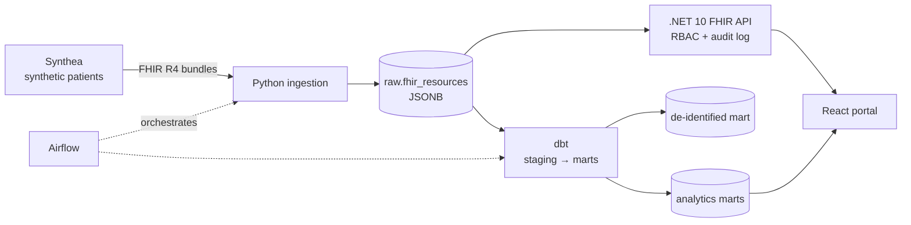

# PulseLake — FHIR Health Data Platform

End-to-end healthcare data platform built on the HL7 FHIR R4 standard: synthetic patient
generation, idempotent ingestion, dbt transformations, de-identified analytics, and a
role-based FHIR API with full audit logging.

> All data is synthetic (generated by Synthea). No real patient data is used.

## Architecture



## Roadmap

- [x] Phase 1 — Infrastructure, synthetic data, idempotent raw ingestion
- [ ] Phase 2 — dbt models, data quality tests, de-identified mart
- [ ] Phase 3 — .NET FHIR API with RBAC and audit logging
- [ ] Phase 4 — React clinician & analyst portal
- [ ] Phase 5 — Airflow orchestration, CI

## Quick start

```bash
cp .env.example .env
docker compose up -d --wait
./scripts/generate_synthea.sh 100
python3 -m venv .venv && source .venv/bin/activate
pip install -r ingestion/requirements.txt
python ingestion/load_fhir.py
```

## Design notes

- **Idempotent ingestion:** re-running the loader on the same data writes zero rows.
- **Change detection:** each resource is hashed (SHA-256 of canonical JSON); only changed resources are rewritten.
- **Bulk loading:** files are streamed via `COPY` into a temp table and upserted in a single statement.
- **Lineage:** every run is recorded in `raw.ingestion_runs` with per-run counts and status.

## Security

- Credentials live only in `.env`, which is git-ignored; `.env.example` contains placeholders.
- `POSTGRES_PASSWORD` has no default: the stack refuses to start without it.
- PostgreSQL is bound to `127.0.0.1` only and is not reachable from the network.
- Generated data (`data/`) and downloaded tools (`tools/`) are never committed.
- Dependencies are monitored by Dependabot.
