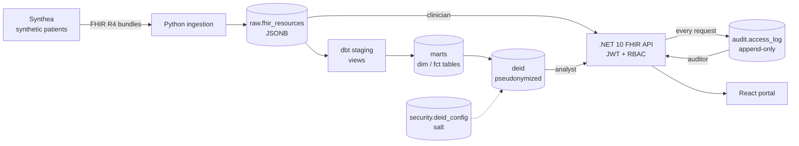

# PulseLake — FHIR Health Data Platform

End-to-end healthcare data platform built on the HL7 FHIR R4 standard: synthetic patient
generation, idempotent ingestion, dbt transformations, de-identified analytics, and a
role-based FHIR API with an append-only audit trail.

> All data is synthetic (generated by Synthea). No real patient data is used.

## Architecture



## Roadmap

- [x] Phase 1 — Infrastructure, synthetic data, idempotent raw ingestion
- [x] Phase 2 — dbt models, data quality tests, de-identified mart
- [x] Phase 3 — .NET FHIR API with RBAC and audit logging
- [ ] Phase 4 — React clinician & analyst portal
- [ ] Phase 5 — Airflow orchestration, CI

## Quick start

```bash
cp .env.example .env
docker compose up -d --wait
./scripts/generate_synthea.sh 100
python3 -m venv .venv && source .venv/bin/activate
pip install -r ingestion/requirements.txt -r transform/requirements.txt
python ingestion/load_fhir.py
./scripts/dbt.sh build
./scripts/setup_api_role.sh
dotnet user-jwts create --project api/PulseLake.Api --name dr.grey --role clinician --output token
./scripts/api.sh
```

## Data model

| Layer | Schema | Models |
|---|---|---|
| Raw | `raw` | `fhir_resources`, `ingestion_runs` |
| Staging | `staging` | `stg_fhir__patients`, `stg_fhir__encounters`, `stg_fhir__conditions`, `stg_fhir__observations` |
| Marts | `marts` | `dim_patients`, `fct_encounters`, `fct_conditions`, `fct_observations` |
| De-identified | `deid` | `deid_patients`, `deid_encounters`, `deid_conditions` |
| Audit | `audit` | `access_log` |

## API

| Role | Access | Endpoints |
|---|---|---|
| `clinician` | Identified FHIR data | `GET /fhir/{type}/{id}`, `GET /fhir/Patient?name=&gender=&birthdate=`, `GET /fhir/{type}?patient=` |
| `analyst` | De-identified data only | `GET /deid/patients`, `GET /deid/stats/top-conditions` |
| `auditor` | Access trail | `GET /audit/access-log` |
| anonymous | Health & conformance | `GET /health`, `GET /fhir/metadata` |

Supported FHIR types: Patient, Encounter, Condition, Observation, Procedure, MedicationRequest,
Immunization, AllergyIntolerance, DiagnosticReport, CarePlan. Responses use `application/fhir+json`,
search returns a `searchset` Bundle, errors return an `OperationOutcome`.

## Design notes

- **Idempotent ingestion:** re-running the loader on the same data writes zero rows.
- **Change detection:** each resource is hashed (SHA-256 of canonical JSON); only changed resources are rewritten.
- **Bulk loading:** files are streamed via `COPY` into a temp table and upserted in a single statement.
- **Lineage:** every run is recorded in `raw.ingestion_runs` with per-run counts and status.
- **De-identification:** direct identifiers removed; IDs replaced with salted SHA-256 keys; dates reduced to year; ages 90+ grouped; ZIP codes truncated to 3 digits (modeled on HIPAA Safe Harbor).
- **Key management:** the pseudonymization salt is generated inside PostgreSQL (`pgcrypto`) in a locked-down `security` schema. It never appears in the repo, in `.env`, or in compiled dbt SQL.
- **Small-cell suppression:** aggregate statistics hide groups with fewer than 5 patients.
- **Data quality:** uniqueness, referential integrity, accepted values, temporal consistency, source placeholder cleanup, and a test that fails the build if any direct identifier column appears in the `deid` schema.

## Security

- Credentials live only in `.env`, which is git-ignored; `.env.example` contains placeholders.
- Passwords have no defaults: the stack refuses to start without them.
- PostgreSQL is bound to `127.0.0.1` only and is not reachable from the network.
- The API connects as `pulselake_api`, a least-privilege role with no access to `marts` or `security`.
- Every `/fhir`, `/deid` and `/audit` request is logged, including rejected 401/403 attempts.
- `audit.access_log` is append-only: triggers block `UPDATE`, `DELETE` and `TRUNCATE`, even for superusers.
- JWT signing keys are stored in .NET user-secrets, outside the repository.
- Rate limiting (120 requests/minute per user), `nosniff`, `DENY` framing and `no-store` caching on every response.
- dbt anonymous usage tracking is disabled.
- Dependencies are monitored by Dependabot (pip and NuGet).
