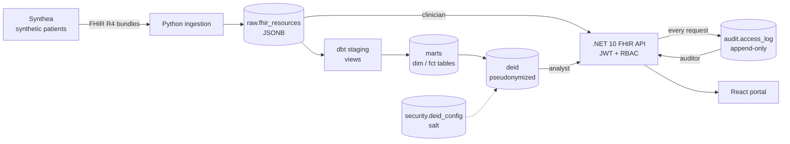
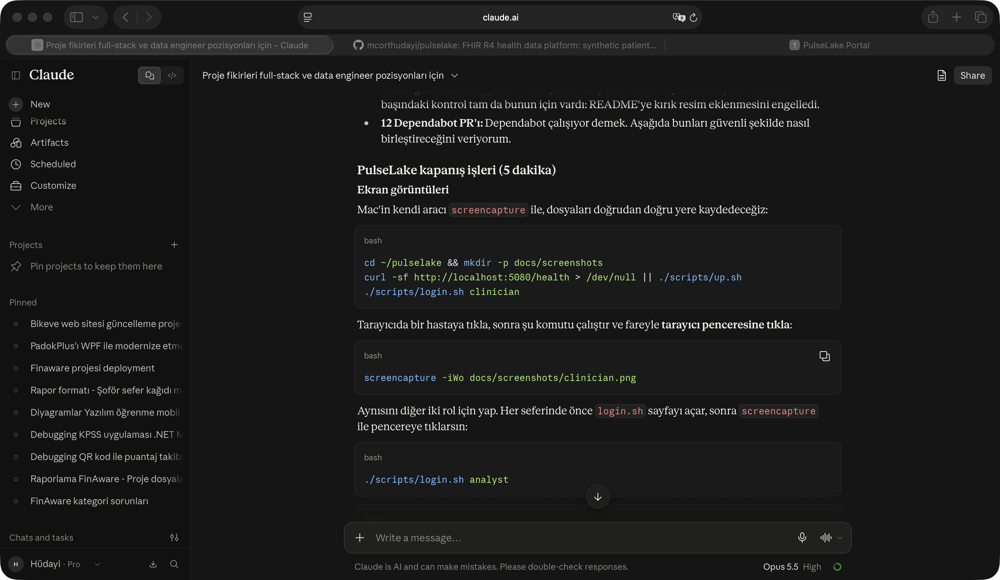
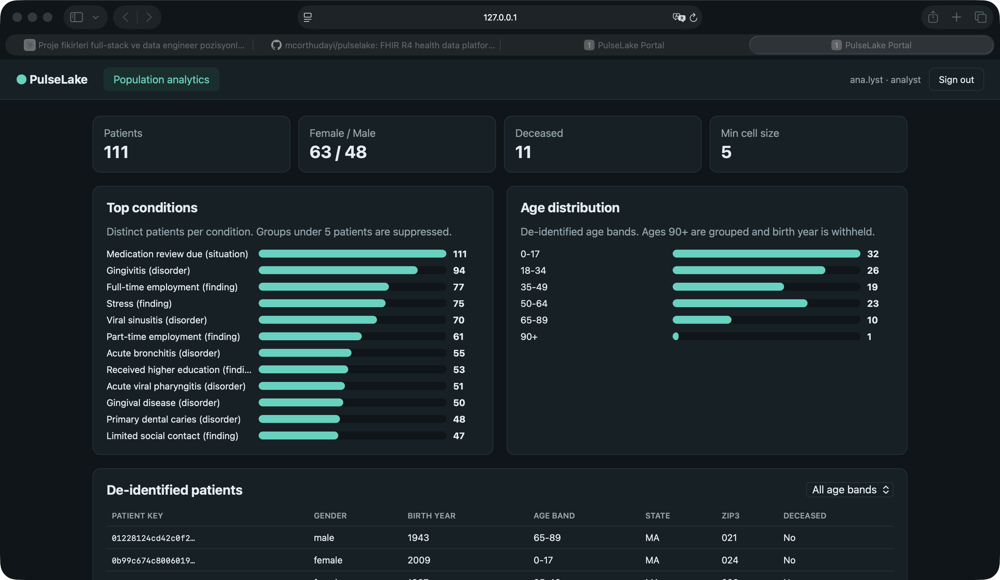
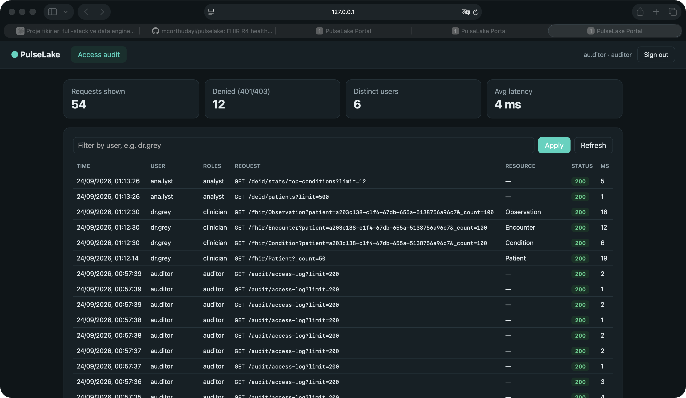

# PulseLake — FHIR Health Data Platform


End-to-end healthcare data platform built on the HL7 FHIR R4 standard: synthetic patient
generation, idempotent ingestion, dbt transformations, de-identified analytics, a role-based
FHIR API with an append-only audit trail, a React portal for clinicians, analysts and auditors,
and a CI pipeline that rebuilds and verifies the whole stack on every push.

> All data is synthetic (generated by Synthea). No real patient data is used.

## Architecture



## Tech stack

| Area | Technology |
|---|---|
| Data generation | Synthea (FHIR R4) |
| Storage | PostgreSQL 16 (JSONB, GIN index, pgcrypto) |
| Ingestion | Python, psycopg 3, `COPY` bulk loading |
| Transformation | dbt Core with 43 data quality tests |
| API | .NET 10 minimal API, JWT bearer, rate limiting |
| Portal | React 19, TypeScript, Vite |
| Delivery | Docker Compose, GitHub Actions, Dependabot, gitleaks |

## Quick start (macOS)

Requirements: Docker Desktop, Python 3.11+, .NET 10 SDK, Node.js 22+.

```bash
./scripts/up.sh
```

One command sets up everything: it creates `.env` with generated passwords, installs dependencies,
starts PostgreSQL, runs the data pipeline, starts the API and the portal in the background,
runs the smoke tests and opens the portal already signed in as a clinician.

```bash
./scripts/login.sh analyst
./scripts/login.sh auditor
./scripts/down.sh
./scripts/down.sh --all
```

## Scripts

| Script | Purpose |
|---|---|
| `up.sh` | Bootstrap and start the whole stack, then open the portal |
| `down.sh` | Stop the API and portal (`--all` also stops PostgreSQL) |
| `login.sh <role>` | Mint a development token and open the portal as that role |
| `pipeline.sh` | Migrations, synthetic data, ingestion, dbt build, API role |
| `smoke_test.sh` | 23 end-to-end checks against the running API and database |
| `api.sh` | Run the API with credentials loaded from `.env` |
| `dbt.sh` | Run any dbt command with credentials loaded from `.env` |

## Data model

| Layer | Schema | Models |
|---|---|---|
| Raw | `raw` | `fhir_resources`, `ingestion_runs` |
| Staging | `staging` | `stg_fhir__patients`, `stg_fhir__encounters`, `stg_fhir__conditions`, `stg_fhir__observations` |
| Marts | `marts` | `dim_patients`, `fct_encounters`, `fct_conditions`, `fct_observations` |
| De-identified | `deid` | `deid_patients`, `deid_encounters`, `deid_conditions` |
| Audit | `audit` | `access_log` |

## API

| Role | Access | Endpoints |
|---|---|---|
| `clinician` | Identified FHIR data | `GET /fhir/{type}/{id}`, `GET /fhir/Patient?name=&gender=&birthdate=`, `GET /fhir/{type}?patient=` |
| `analyst` | De-identified data only | `GET /deid/patients`, `GET /deid/stats/top-conditions` |
| `auditor` | Access trail | `GET /audit/access-log` |
| anonymous | Health & conformance | `GET /health`, `GET /fhir/metadata` |

Supported FHIR types: Patient, Encounter, Condition, Observation, Procedure, MedicationRequest,
Immunization, AllergyIntolerance, DiagnosticReport, CarePlan. Responses use `application/fhir+json`,
search returns a `searchset` Bundle ordered by clinical date (newest first), errors return an `OperationOutcome`.

## Portal

| View | Role | Shows |
|---|---|---|
| Clinical records | `clinician` | Patient search, active conditions, latest observations, encounters |
| Population analytics | `analyst` | Top conditions (small-cell suppressed), age distribution, pseudonymized patient table |
| Access audit | `auditor` | Every request with user, role, resource and status; denied attempts highlighted |

Tokens are held in memory only (no localStorage). In development, `login.sh` passes the token in the
URL fragment, which is never sent to a server and is removed from the address bar immediately.
The portal reaches the API through the Vite proxy, so the API does not need to enable CORS.

## Testing

| Layer | What is verified |
|---|---|
| dbt (43 tests) | Uniqueness, referential integrity, accepted values, temporal consistency, no direct identifiers in `deid` |
| Ingestion | Re-running the loader writes zero rows (idempotency) |
| `smoke_test.sh` (23 checks) | API contract, RBAC matrix for all three roles, audit logging, append-only audit table, least-privilege DB role |
| CI | Full pipeline from an empty database on every push, plus secret scanning and dependency audits for pip, npm and NuGet |

## Design notes

- **Idempotent ingestion:** re-running the loader on the same data writes zero rows.
- **Change detection:** each resource is hashed (SHA-256 of canonical JSON); only changed resources are rewritten.
- **Bulk loading:** files are streamed via `COPY` into a temp table and upserted in a single statement.
- **Lineage:** every run is recorded in `raw.ingestion_runs` with per-run counts and status.
- **Re-runnable migrations:** every SQL migration is idempotent and safe to apply repeatedly.
- **De-identification:** direct identifiers removed; IDs replaced with salted SHA-256 keys; dates reduced to year; ages 90+ grouped; ZIP codes truncated to 3 digits (modeled on HIPAA Safe Harbor).
- **Key management:** the pseudonymization salt is generated inside PostgreSQL (`pgcrypto`) in a locked-down `security` schema. It never appears in the repo, in `.env`, or in compiled dbt SQL.
- **Small-cell suppression:** aggregate statistics hide groups with fewer than 5 patients.
- **Data quality:** source placeholder values (such as invalid ZIP codes) are cleaned in staging.

## Security

- Credentials live only in `.env`, which is git-ignored; `.env.example` contains placeholders.
- Passwords have no defaults, and the pipeline refuses to run with placeholder values.
- PostgreSQL is bound to `127.0.0.1` only and is not reachable from the network.
- The API connects as `pulselake_api`, a least-privilege role that can read raw FHIR and de-identified data, append to the audit log, and nothing else.
- Every `/fhir`, `/deid` and `/audit` request is logged, including rejected 401/403 attempts.
- `audit.access_log` is append-only: triggers reject `UPDATE`, `DELETE` and `TRUNCATE`; bypassing them requires an explicit schema change.
- JWT signing keys are stored in .NET user-secrets, outside the repository.
- Rate limiting (120 requests/minute per user), `nosniff`, `DENY` framing and `no-store` caching on every response.
- The portal keeps tokens in memory only, accepts URL tokens only in development, and sends no referrer.
- dbt anonymous usage tracking is disabled.
- Dependencies are monitored by Dependabot (pip, NuGet, npm and GitHub Actions).

## Screenshots

| Clinical records | Population analytics | Access audit |
|---|---|---|
|  |  |  |
